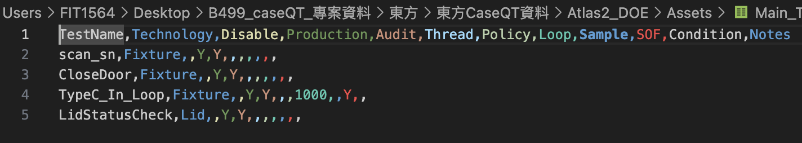
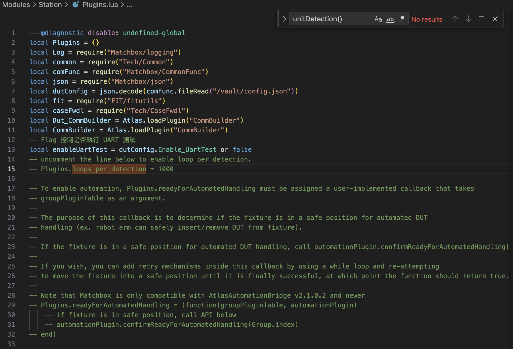

## 1. 簡介

在 Atlas2中，要讓測項重複執行（迴圈），最直接的方法就是修改 **`Loop`** 欄位。

要讓所有測項執行 1000 輪，你有兩種方法：

### 1：**直接在 CSV 中設定 Loop 值**
- 在main.csv 的 `Loop` 欄位中填入 `1000`
- 這樣每個測項就會執行 `1000` 次

  <figure style="margin:0; justify-content: center;">
    
  </figure>

- 但此時是測項1執行1000次後才接續執行測項2

- 全部執行要在所有測項加的 `Loop` 欄位中填入 `1000`

這可能不符合我們想要的

### 2：**使用外層迴圈控制**
- 在 Lua 的序列控制或狀態機中，用迴圈包裝整個測試序列
- 這樣可以更靈活地控制迴圈邏輯
- 其中：
1. **`loopAgain()` 函數** - 控制整個測試序列是否重複
2. **`loops_per_detection` 變數** - 在 `userPluginModule` 中定義（Station/Plugins.lua）
3. **`unitDetection()` 函數** - 設定每個單位檢測週期應該執行多少輪（Matchbox/group.lua）

在 `Plugins.lua` 中設定 `loops_per_detection = 1000`。

  <figure style="margin:0; justify-content: center;">
    
  </figure>

- 這個設定會讓測試系統每次檢測到一個單位後，自動執行 Init → Main → Teardown 的完整測試序列 1000 次
- 系統會透過 `loopAgain()` 函數來控制是否進行下一輪，當 `loopsLeft` 大於 0 時繼續循環

實現做 1000 次的功能（待驗證）

  <figure style="margin:0; justify-content: center;">
    
  </figure>

---

