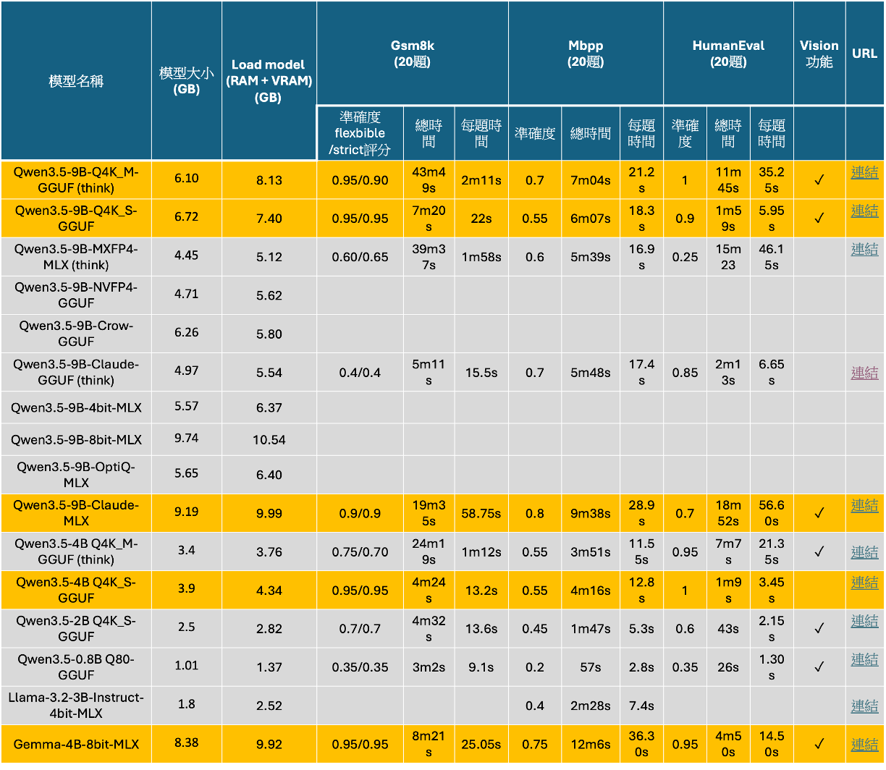
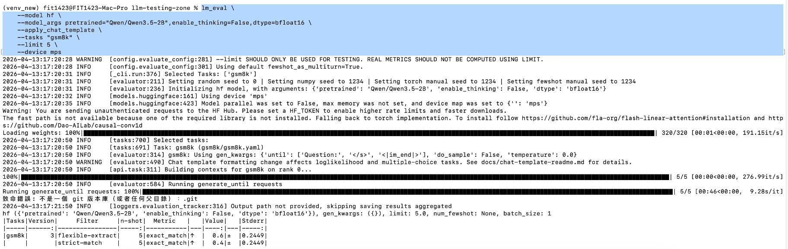
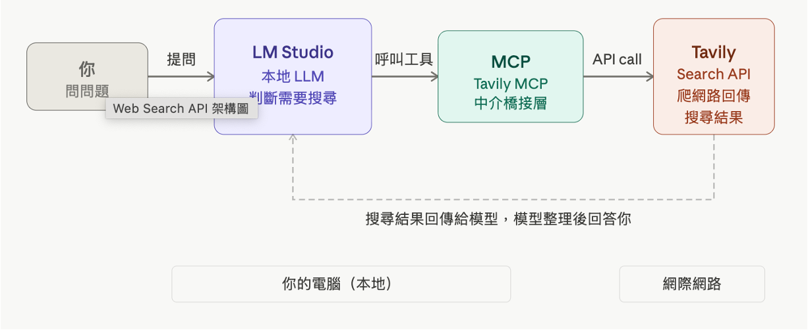
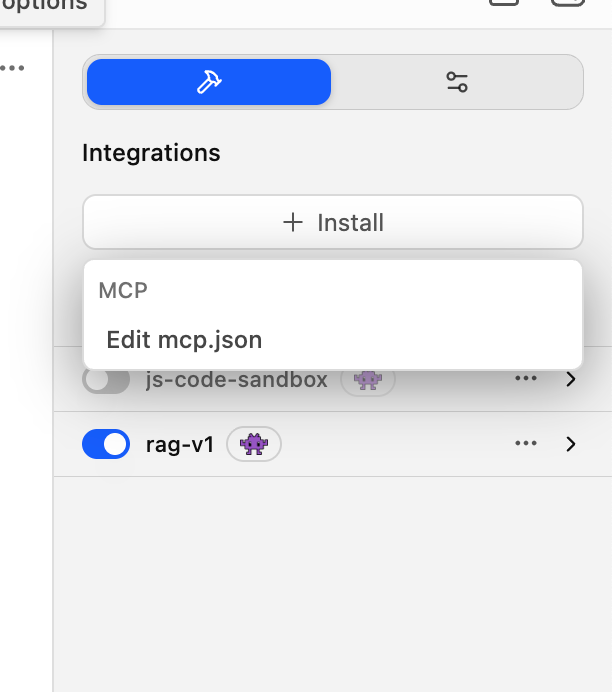
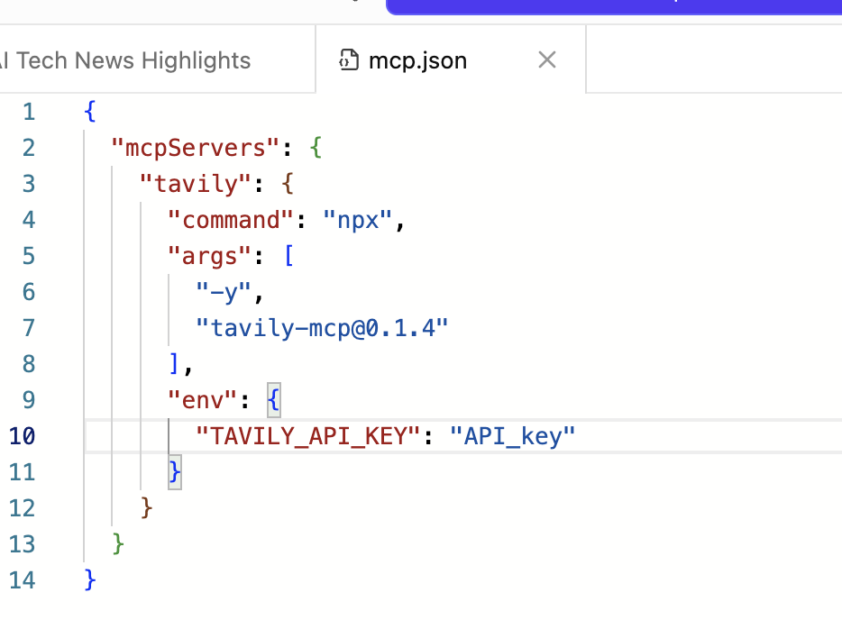
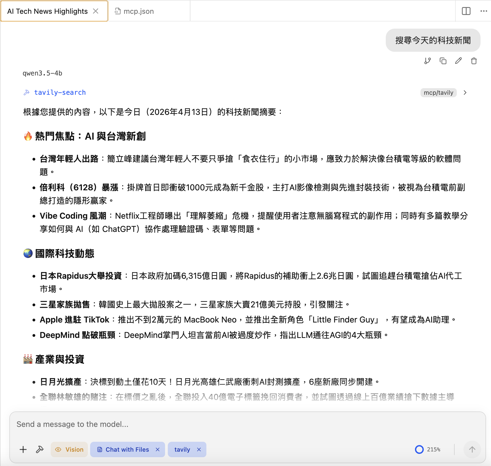

# LLM模型測試比較

本次測試結果加入修改地方為:

1.對於Gsm8K問題集，針對非思考LLM模型統一改成zero shot方式，加入system prompt進行測試，將思考跟非思考模型測試方式統一。

2.加入HumanEval程式測試集。

3.加入vision功能。

4.加入每個模型的URL。

最終測試結果如下表所示，橘色顯示的地方為這幾次測試挑選出來較佳的模型，這些模型針對不同測試集至少有超過準確度0.5評分。

針對這些較佳的模型，進一步做分析挑選:

1.其中準確度最高的是Qwen3.5-9B-Q4K_M-GGUF模型與Gemma-4B-8bit-MLX，Gemma目前測試起來時間會比Qwem3.5-9B的測試時間短，因此，Gemma-4B可以視為是最佳的模型之一。 

2.如果要以時間速度為主要考量，同時兼顧較低的運算效能，Qwen3.5-4B-Q4K_S-GGUF模型會比較適合，因為此模型測試出來的準確度，除了在mbpp稍微低一點以外，其他都很高，甚至跟9B版本比，有同樣的精確度。

 

  

# LM_eval套件---Load Hugging Face model 

LM eval套件可在指令中加入—model hf 可呼叫Hugging Face的模型，底層的運作是透過python的transfomer套件實作推論引擎，比較常見是讀取全精度的模型，而不是量化模型。

考量電腦效能，選擇Qwen3.5-2B模型載入。輸入以下指令，如果偵測沒有模型，就會自動下載模型。下載完之後，會跑LM eval測試，測試完成會顯示測試結果。

透過這種方式，實際嘗試max token針對mac m4筆電，維持在1024比較可執行。

採用hf model的方式好處是有選項可控制模型是否有思考進行測試。

 

  

# LLM擴充功能—-web search

LM studio可當作MCP client端去呼叫MCP server，就可以去呼叫API進行服務的應用。這邊採用Tavily的服務，這是網路搜尋功能的服務。註冊之後可免費使用，其免費額度為每月1000點。

 

  

在LM studio上右邊欄位可點選install點選Edit mcp.json。

 

  

在mcp.json進行以下設定，並輸入tavity的API key。

 

  

設定完成之後可以對話匡下方欄位出現tavily的tag，像是下prompt輸入搜尋今天的科技新聞，他就可以從網路搜尋當日的科技新聞。

透過這種方式就可以在LM studio上實現網路搜尋功能。

 

  

