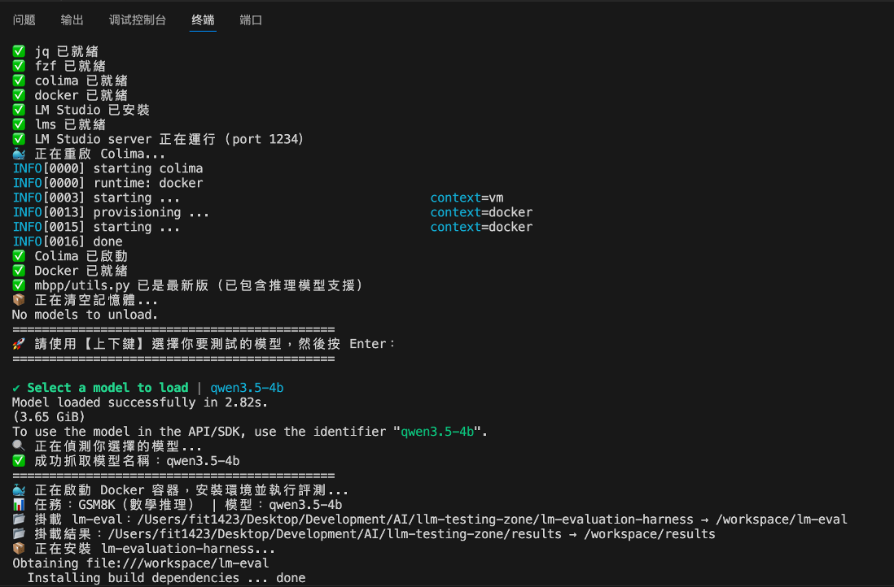
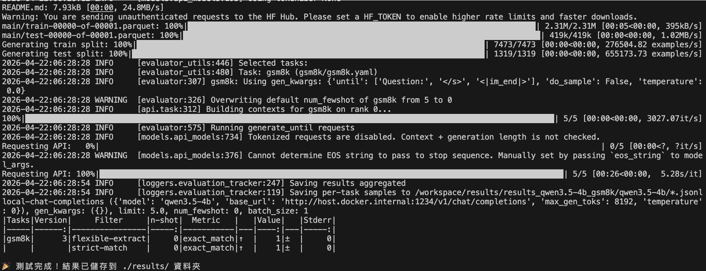
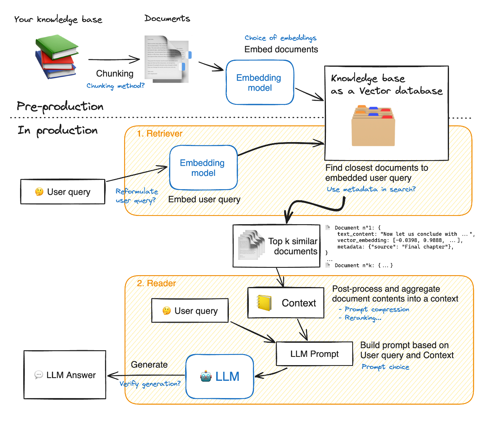

# LLM模型測試比較

本次測試結果加入修改地方為:

1.加入MATH資料集，MATH資料集為高中數學競賽題目，包含代數、幾何等等的類別。

2.加入Qwen2.5 Coder模型。

3.加入Llama3.2 3B模型。

4.表格加入Tool use功能。

最終測試結果如下表所示：
1. 加入MATH測試及進行測試，對於先前選出的模型，準確度皆大於0.7。
2. 其中對於MATH資料集測出評分最高的是Gemma4模型，準確度為1，Gemma4可視為通用模型。
3. Qwen2.5 Coder模型，MBPP準確度為0.85, HumanEval準確度為1，是目前程式題測試最高分的模型。  
 

  

# Shell測試腳本開發 

先前進行模型測試，是採用LM eval套件，在terminal輸入LM eval指令針對各項任務進行測試。由於針對不同任務的指令都不同，會造成測試上比較不方便。因此，此處開發shell測試腳本，可透過選單方式選擇模型以及任務方便進行自動化測試。
 

  

 

  

# RAG測試腳本研讀

研讀Jason提供的Hugging Face Cockbook，此方式是採用Langchain建立RAG測試框架，其做法為可從檔案庫當中讀取文件，並進行chunk與tokenize，輸入到embedded model進行編碼，再將編碼向量存入FAISS向量資料庫。之後可根據使用者query到向量資料庫中進行相似度搜尋，透過cosine相似度的計算方式，可找出最相似k份chunk，再將這些chunk以及使用者query組成prompt輸入到LLM當中，產生回答。可以再串接雲端AI模型進行回答評分。透過這種方式，就可以測試模型針對RAG整合的能力。
 

  

 

