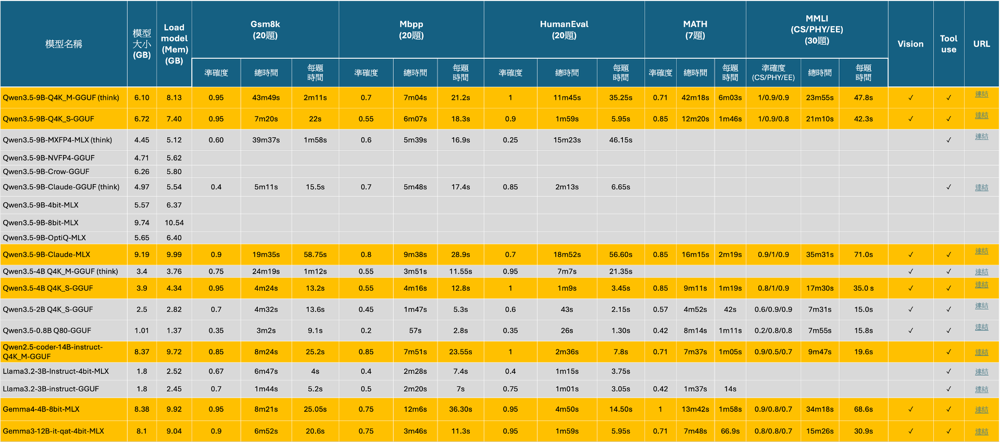

# LLM模型測試比較

本次測試結果加入修改地方為:

1. 加入MMLU資料集，MMLU是AI綜合能力測驗的題目，涵蓋非常多個學科，其難度是接近大學或專業考試的難度。此處，我們挑選與工程開發相關的學科，其中包含CS(電腦科學), PHY(物理), EE(電機工程)。

2. 加入Gemma3 12B模型qat版本。qat是Quantization Aware Training（量化感知訓練）是讓模型在訓練過程中讓模型提早適應誤差，以減少壓縮而造成的品質降低。

最終測試結果如下表所示：
1. 加入MMLU三門學科進行測試，4B以上模型的精確度皆有大於0.7。
2. 在2B, 0.8B參數量減少之後，對於CS科目表現明顯變差，同時也可觀察到mbpp, humaneval準確度也是表現不佳，代表模型參數量減少會造成寫程式以及CS能力減低，因此，如果有coding的應用場景，對於這種小模型應該要避免，或是客制化進行壓縮與微調。
3. Gemma3準確度與Gemma4相近，Gemma3推論時間更短。
 

  

 

