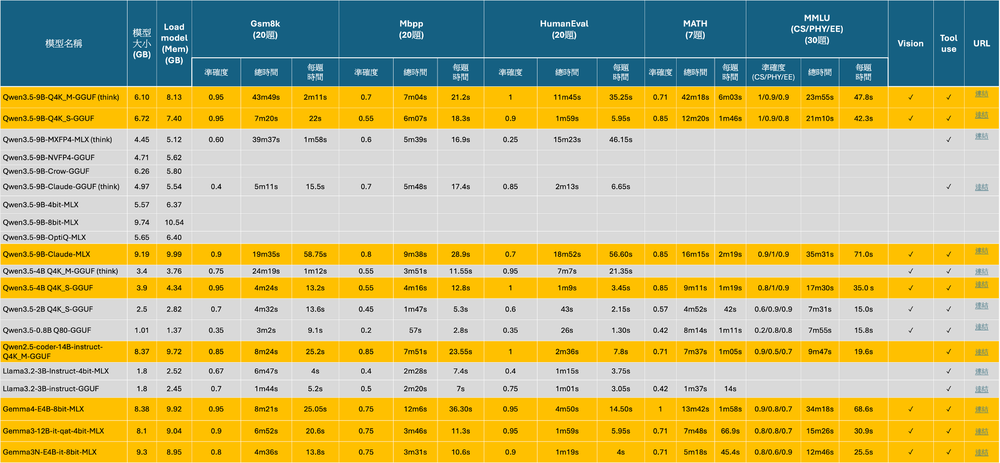
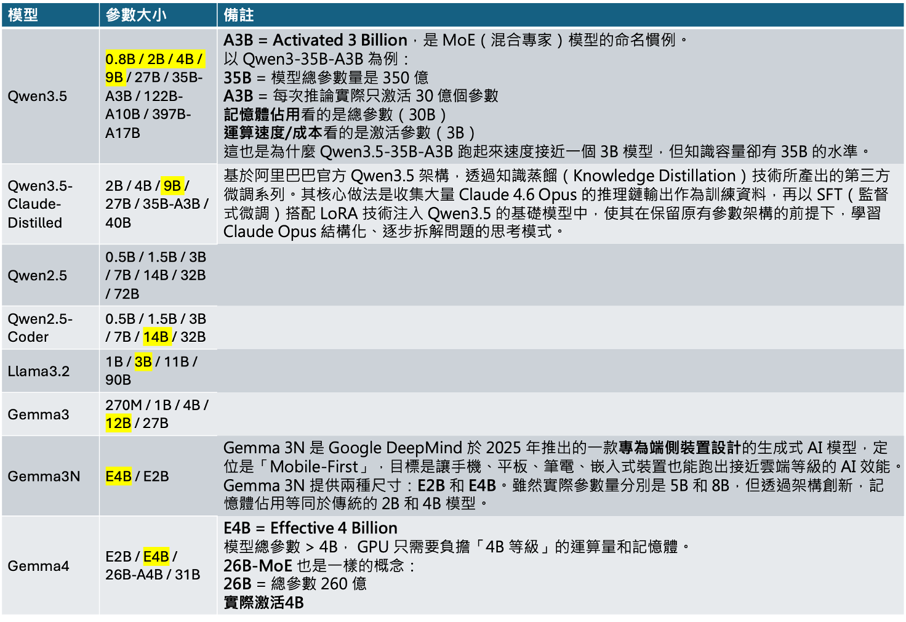

# LLM模型測試比較

本次測試結果加入修改地方為:

1. 加入Gemma3N版本，Gemma3N採用PLE技術，將原本傳統的embedding從GPU放到CPU，以節省GPU記憶體的佔用。
2. Gemma3N與Gemma3相比，大致上整體準確度相近，Gemma3N的運算時間有比Gemma3短， 想要以運算速度為優先的話，可選擇Gemma3N。



<a href="/swblog/llm_table/llm_table2.html" download target="_blank">📥 下載表格 HTML</a>

 

  

 

# LLM模型參數家族
LLM model對於各種模型有不同參數量的家族，有測試過的以黃色標示:
1. Qwen3.5版本當中，比較特別是有35BA3B，這代表實際load 35B的參數量，是包含許多專家的MOE模型，但在實際推論時，只會用到3B的參數，可以增加運算的速度。
2. Qwen3.5除了官方版本外，還有第三方的所製作的Claude知識蒸餾版本。
3. Qwen2.5還有Qwen2.5 coder版本，可讓模型特別專精在寫程式。
4. Gemma3則是有特別應用在行動與嵌入式裝置的版本Gemma3N。

 

  

<a href="/swblog/llm_table/llm_table2.pptx" download target="_blank">📥 下載 PowerPoint</a>

