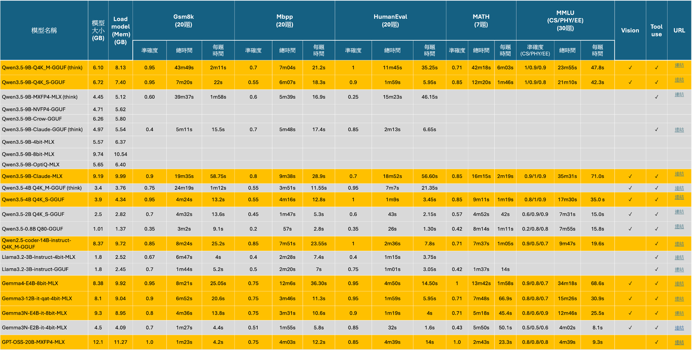
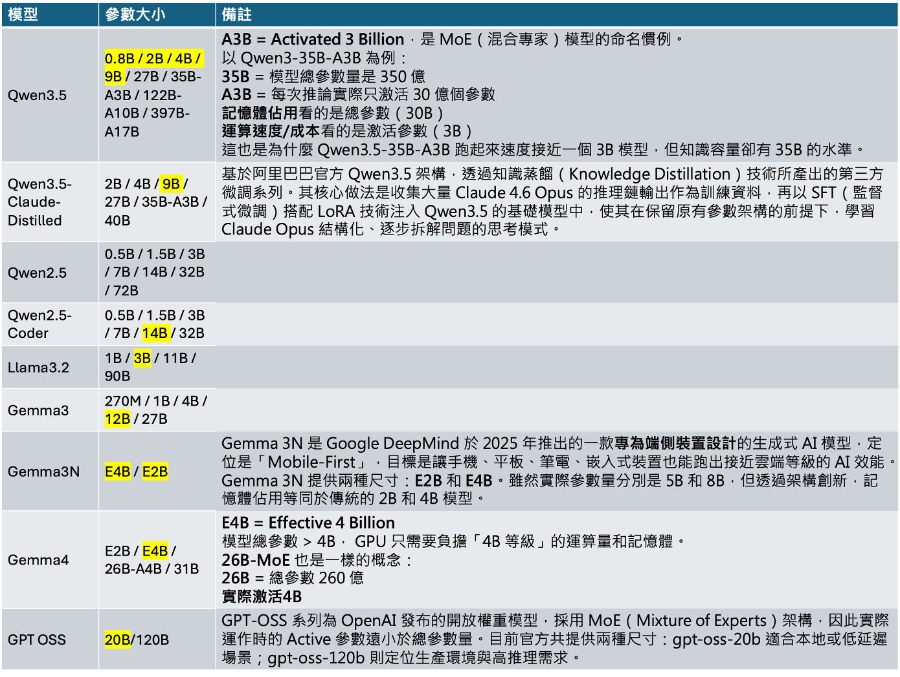

# LLM模型測試比較

本次測試結果加入修改地方為:

1. 加入Gemma3N E2B版本，與E4B相比，模型大小與消耗記憶體大小都少了一半，準確度有明顯下降。另外值得觀察的是相較於llama3.2 3B GGUF版本，除了MMLU資料集尚未測試，觀察已測試的準確度與Gemma3N E2B版本相近，模型大小與消耗記憶體大小卻少了一半，因此，Llama3.2 3B模型目前看起來仍是有潛力的模型，確切結果還須待llama3.2進行MMLU測試才能下定論。
2. 加入GPT OSS 20B版本，此版本模型大小與消耗記憶體大小特別多，在Mac mini上無法載入運行，目前是在本地電腦(Macbook pro)進行測試，此模型在GSM8K, MATH數學資料集皆獲得滿分，程式題目以及MMLU測試集目前準確度維持在一定水準，目前也是將此模型納入候選的模型之一。



<a href="/swblog/llm_table/llm_table3.html" download target="_blank">📥 下載表格 HTML</a>

 

  

 

# LLM模型參數家族
LLM model對於各種模型有不同參數量的家族，有測試過的以黃色標示:
1. 加入GPT釋出的開源模型，其參數家族有20B與120B，此模型是在2025年發表。

 

  

<a href="/swblog/llm_table/llm_table3.pptx" download target="_blank">📥 下載 PowerPoint</a>

