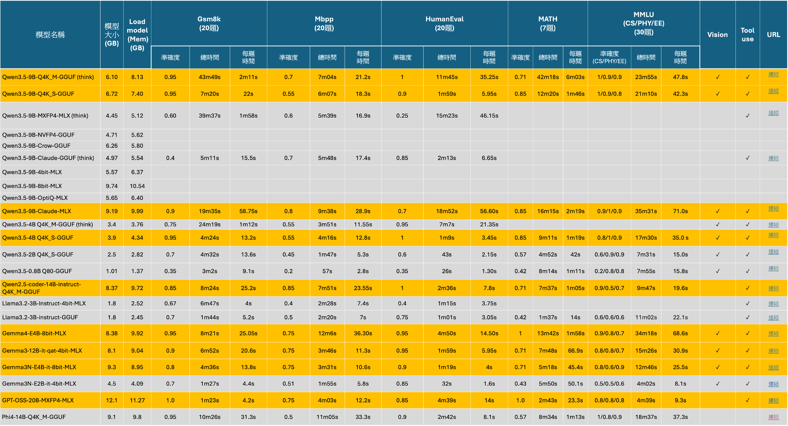
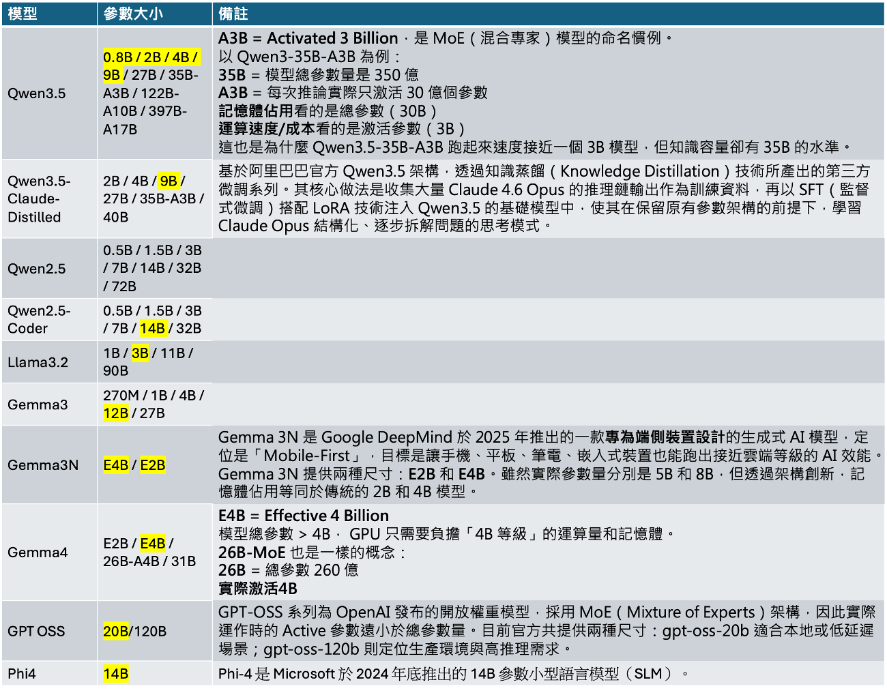

# LLM模型測試比較

本次測試結果加入修改地方為:

1. 新增llama 3B GGUF對於MMLU資料集的測試，目前可看到與Gemma3N E2B相比，整體準確度相近，Gemma3N E2B所消耗大小與記憶體空間都比llama 3B較多，因此，對於嵌入式裝置而言，較不考慮Gemma3N E2B, 將採用llama 3B。
2. 加入phi4 14B測試，MBPP與MATH分數偏低，MMLU分數偏高，消耗資源偏多，暫時不考慮這樣的模型。



<a href="/swblog/llm_table/llm_table4.html" download target="_blank">📥 下載表格 HTML</a>

 

  

 

# LLM模型參數家族
LLM model對於各種模型有不同參數量的家族，有測試過的以黃色標示:
1. 加入GPT釋出的開源模型，其參數家族有20B與120B，此模型是在2025年發表。

 

  

<a href="/swblog/llm_table/llm_table4.pptx" download target="_blank">📥 下載 PowerPoint</a>

