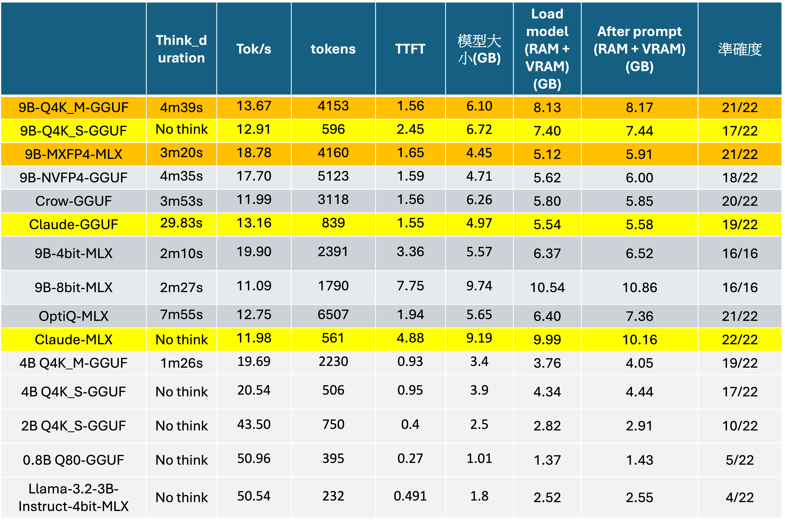

# 測試條件
以下是針對Qwen3.5不同參數量化模型以及Llama模型的測試比較。

總共擬定三組問題集，輸入到這些模型進行測試。

會取得模型測試指標像是think duration(思考時間), tok/s(推論速度), tokens, TTFT表示模型推論的效能。

以及模型大小, 在load model, 以及輸入prompt之後所消耗的運算資源(RAM+VRAM)。

還有模型回答的準確度。
# 測試結果

測試結果如下表格所示:

有些模型會觸發思考，有些模型不會思考會直接給出答案，整體模型回覆時間除了與推論時間有關，思考時間也有佔很大一部分比例，因此，思考時間越長的模型，通常整體回覆會越久。

對於9B-4bit-MLX, 9B-8bit-MLX 這兩組模型在第三組測試題目，有產生思考卡住的情形。

除了上述這兩組模型，基本上的趨勢是模型參數量越少，整體回覆速度越快。

其中在4B模型是最佳的甜蜜點，可以有比較輕量化的架構，同時又維持不錯精準度。

對於9B模型而言，9B_Q4K_S_GGUF, Claude_GGUF, Claude_MLX思考比例少甚至不思考，同時能有好的準確度，這類模型適合應用在需要快速回覆的場景:

像是

- 翻譯、摘要、改寫
- 簡單知識問答、資訊擷取
- 日常對話、聊天機器人
- 格式轉換（JSON、CSV 等）
- 分類、情感分析
- 大量批次處理（控制成本）

對於9B_Q4K_M_GGUF, 9B_MXFP4_MLX會有一定的思考時間，也有好的準確度，適合用在需要思考之後回覆的場景：

像是

- 數學證明與計算
- 程式除錯、演算法設計
- 邏輯推理、腦筋急轉彎
- 複雜規劃（排程、策略制定）
- 多條件約束問題
- 需要自我驗證與修正的任務

其中9B_MXFP4_MLX量化，有不錯的推論速度。Claude GGUF則是在思考模型當中有最少的思考時間。
 
 

  

