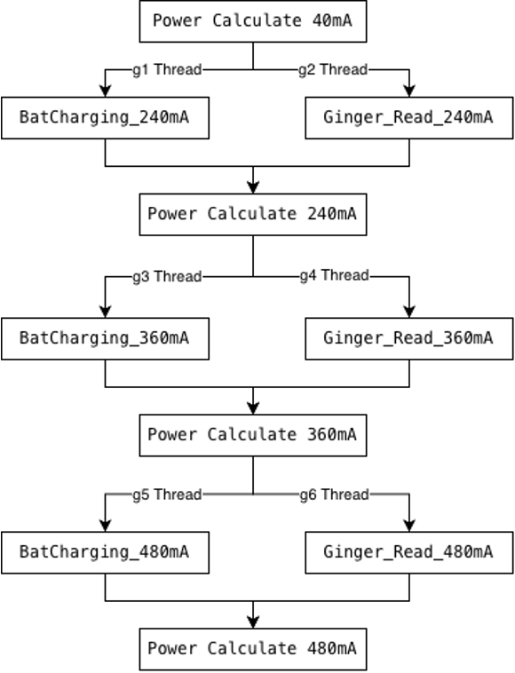

### E&F Wireless Charging Case Study

本文說明在 **Atlas2 測試流程中導入 Parallel Threads 時**，如何處理 **Data Dependency 與 Merge 衝突問題**。

### 效能優化成果 (Performance Benefit)

透過導入 Data Dependency 技術並優化 Scheduler 設定，測試效率得到顯著提升：

* **導入 Data Dependency 技術，優化測試流程效率**
    * 總體測試時間由 **1:14 → 0:58**
    * 測試時間下降約 **21%**

---

### Test Scheduler Configuration

以下為 Wireless Charging 測試流程的 Scheduler 範例：

| TestName                         | Technology | Thread |
|---------------------------------|-----------|--------|
| PowerTransfer_BatCharging_240mA | Fwdl      | g1     |
| Transition_Ginger_Read_240mA    | Process   | g2     |
| Transition_Ginger_Power_240mA   | Process   |        |
| PowerTransfer_BatCharging_360mA | Fwdl      | g3     |
| Transition_Ginger_Read_360mA    | Process   | g4     |
| Transition_Ginger_Power_360mA   | Process   |        |
| PowerTransfer_BatCharging_480mA | Fwdl      | g5     |
| Transition_Ginger_Read_480mA    | Process   | g6     |

#### Thread 運作邏輯說明：
1.  **平行執行**：透過指定 **Thread Group (g1 ~ g6)**，Atlas2 會將測項分配至不同的線程同時執行，以極大化測試效率。
2.  **自動合併 (Implicit Merge)**：若 Thread 欄位**沒有接對應的變數名稱（留空）時，系統將視為合併點**。這表示該測項必須等待前方的平行 Thread 全部執行完畢，回到主線程 (Main Thread) 後才會執行。

---

### Parallel Execution Flow

下圖展示了多個 Thread 同時執行並嘗試將結果合併至主表的邏輯：

<figure style="text-align: center; margin: 20px auto;">
  
  <figcaption style="margin-top: 10px; color: #666; font-style: italic;">
    fig 1. Atlas2 Parallel Threads 執行與數據合併流程圖
  </figcaption>
</figure>

---

### Data Dependency 問題

在獲得效能提升的同時，若「自動合併」的邏輯未處理好，就會出現不穩定問題。

#### 1. Observation
當部分測項被放入 **不同 Thread 平行執行** 時：
* 測試流程偶發中斷
* 測試結果無法正確合併
* Thread 之間無法正確取得彼此的 Input / Output

#### 2. Finding
問題來源為：**「相同 Result Key 在不同 Threads 被同時更新」**。

Atlas2 在執行 Merge（合併回主線）時偵測到 **資料衝突 (Data Conflict)**，因此直接中止流程。

**Error Message:**
```text
MergeTable.lua: key bResult updated in different threads!
value before parallel: nil
values in threads: true, true