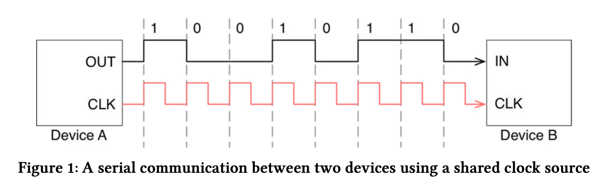

UART（Universal Asynchronous Receiver/Transmitter）是嵌入式系統中最常見的序列通訊介面之一，廣泛應用於 MCU 與電腦、感測器、WiFi/BT/GPS 模組之間的資料交換。在韌體開發過程中，UART 驅動是否穩定，會直接影響系統除錯與產品可靠度，因此建立完整的 UART 測試流程非常重要。

---

# 一、UART 基本原理

UART 屬於**非同步通訊**，不需要時脈線（Clock），透過雙方事先約定的：

- Baud rate（鮑率）
- Data bits（資料位元數）
- Parity（同位元檢查）
- Stop bits（停止位元）

常見設定：

```
115200, 8N1
```

代表：

- 115200 bps  
- 8 data bits  
- No parity  
- 1 stop bit  


<p align="center">
  
</p>

# 二、UART 硬體測試架構

## 1. PC 對 MCU 測試

最常見測試方式：

```
電腦 (USB)
   │
USB-to-UART 轉換器
   │
MCU (TX, RX, GND)
```

### 常見 USB-UART 晶片

- FTDI
- CP2102
- CH340

### 接線方式

| USB-UART | MCU |
|----------|------|
| TX       | RX   |
| RX       | TX   |
| GND      | GND  |

> ⚠️ TX 必須接對方 RX，且雙方必須共地。

---

# 三、UART 測試方法

---

## 1. Loopback 測試（最基本）

將 MCU 的 TX 與 RX 直接短接：

```
TX ─── RX
```

傳送資料後如果收到相同資料，表示：

- UART TX 正常
- UART RX 正常
- Baud rate 設定正確

---

## 2. PC Terminal 測試

常用工具：

- PuTTY  
- Tera Term  
- RealTerm  

### 測試步驟

1. 設定相同 baud rate  
2. MCU 持續輸出字串（例如 printf）  
3. PC 觀察是否正確顯示  

### 測試項目

| 測試內容 | 目的 |
|----------|------|
| 傳固定字串 | 驗證 TX |
| 鍵盤輸入 | 驗證 RX |
| 長時間連續輸出 | 穩定度測試 |
| 高速連續傳輸 | Buffer 壓力測試 |

---

## 3. Interrupt 模式測試

```c
void HAL_UART_RxCpltCallback(UART_HandleTypeDef *huart)
{
    process_data(rx_buffer);
    HAL_UART_Receive_IT(&huart1, rx_buffer, 1);  // 重新啟動接收
}
```

### 測試重點

- 是否每次接收都進入 callback  
- 是否漏資料  
- 是否出現 Overrun Error  

---

## 4. DMA 模式測試

```c
if(tx_done)
{
    tx_done = 0;
    HAL_UART_Transmit_DMA(&huart1, tx_buffer, size);
}
```

Callback：

```c
void HAL_UART_TxCpltCallback(UART_HandleTypeDef *huart)
{
    tx_done = 1;
}
```

### 測試項目

- 不同長度資料傳輸  
- 連續高速傳送（如 921600 bps）  
- 是否卡在 BUSY 狀態  
- 是否重複傳送  

---

# 四、進階測試項目

## 1. 壓力測試

長時間（1 小時以上）連續傳送：

- 是否 memory leak  
- 是否 buffer overflow  
- 是否中斷失效  

---

## 2. 錯誤測試

觀察 UART Error Flag：

- Overrun Error (ORE)  
- Framing Error  
- Noise Error  

---

## 3. 波形量測（進階）

使用示波器或邏輯分析儀量測：

例如 115200 bps：

```
1 bit ≈ 8.68 µs
```

若誤差過大可能造成通訊不穩定。

---

# 五、常見問題分析

## 問題一：顯示亂碼

可能原因：

- Baud rate 不一致  
- 系統 clock 設定錯誤  
- PLL 設定錯誤  

---

## 問題二：只能傳一次

可能原因：

- tx_done flag 未設回 1  
- DMA 未重新啟動  
- 狀態機卡在 BUSY  

---

## 問題三：資料漏接

可能原因：

- RX interrupt 未重新 enable  
- Buffer 太小  
- CPU 被高優先權任務佔用  

---

# 六、UART 驅動驗證 Checklist

- [ ] Baud rate 正確  
- [ ] TX/RX 接線正確  
- [ ] GND 共地  
- [ ] Interrupt 有進  
- [ ] DMA callback 正常  
- [ ] Error flag 有清除  
- [ ] 長時間測試穩定  

---

# 七、建議測試流程

1. 先使用 Polling 驗證基本收發  
2. 再使用 Interrupt 驗證 ISR 機制  
3. 最後使用 DMA 驗證高效能與穩定性  

---

# 結語

UART 測試不只是確認能不能印出 printf，而是要驗證：

- 穩定性  
- 邊界條件  
- 錯誤處理  
- 長時間可靠度  

