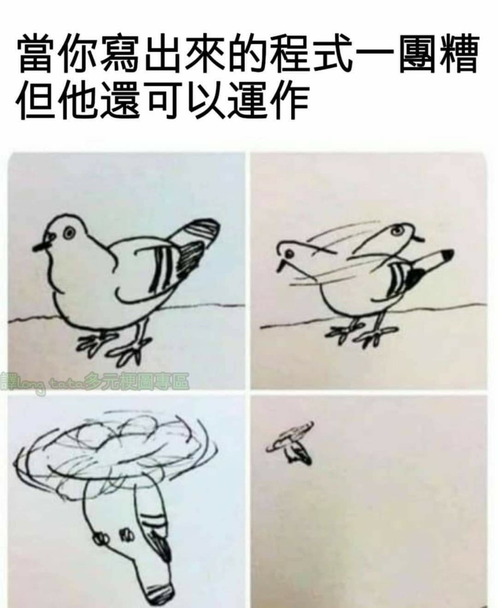

## Background

在某個 Python GUI 專案中，原本的 UI 是使用 **PySide6 QWidget** 開發。  
隨著 UI 逐漸變複雜，我嘗試將 UI 改為 **QML + Python backend** 的架構。

主要目的是：

- 讓 UI 與邏輯分離
- 更容易調整 UI layout
- 讓程式結構更清楚

---

## Original QWidget Example

在 QWidget 中，UI 與邏輯通常會寫在同一個 class：

from PySide6.QtWidgets import QPushButton

button = QPushButton("Run Test")
button.clicked.connect(run_test)


當 UI 元件變多時，程式容易變得難以維護。

---

## QML Approach

使用 QML 時，UI 可以寫得比較簡潔：



import QtQuick
import QtQuick.Controls

Button {
    text: "Run Test"

    onClicked: {
        controller.run_test()
    }
}



UI 與 Python backend 可以清楚分離。

---

## Python Controller

Python 端負責處理邏輯：



from PySide6.QtCore import QObject, Slot

class TestController(QObject):

    @Slot()
    def run_test(self):
        print("Running test...")



再將 controller 暴露給 QML 使用即可。

---

## Conclusion

將 PySide6 UI 改為 QML + Python controller 之後：

UI 更容易調整

架構更清楚

UI 與邏輯成功分離

對於 UI 逐漸變複雜的 Qt 專案來說，
QML 是一個值得考慮的方向。

圖片測試

